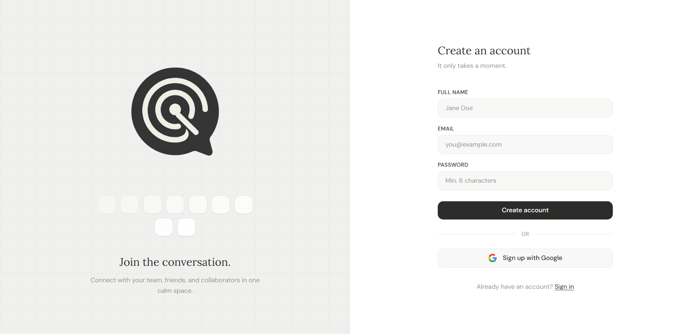
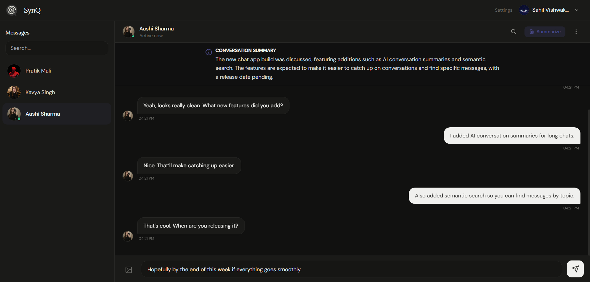
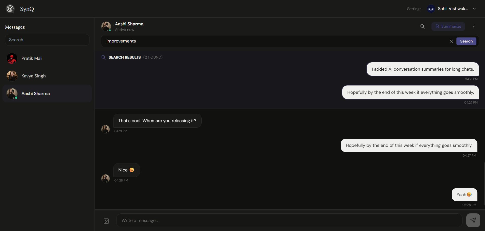

<p align="center">
  
</p>

<h1 align="center">SYNQ</h1>

<p align="center">
<strong>Real-time chat reimagined with AI-powered intelligence</strong>
</p>

<p align="center">
A modern full-stack chat application featuring real-time messaging, AI conversation summarization, semantic search powered by embeddings, and secure authentication with Google OAuth.
</p>

<p align="center">
<a href="#features">Features</a> •
<a href="#demo">Demo</a> •
<a href="#installation">Installation</a> •
<a href="#tech-stack">Tech Stack</a> •
<a href="#api-reference">API</a>
</p>

<p align="center">


</p>

---

<p align="center">

</p>

---

# Why SYNQ?

Traditional chat apps let you send messages. **SYNQ** focuses on understanding conversations.

- Lost in long chats? Generate AI summaries instantly
- Can't find a message? Search by meaning
- Need live updates? Real-time messaging with typing indicators

---

# Features

<table>
<tr>
<td width="50%">

### Real-time Messaging

Instant message delivery powered by Socket.io with typing indicators.

</td>
<td width="50%">

### AI Summarization

Generate conversation summaries using LLM integration.

</td>
</tr>

<tr>
<td>

### Semantic Search

Find messages by meaning using text embeddings.

</td>
<td>

### Online Presence

Real-time online/offline user tracking.

</td>
</tr>

<tr>
<td>

### Image Sharing

Send images using Cloudinary integration.

</td>
<td>

### Dark Mode

Clean dark theme with smooth UI.

</td>
</tr>

<tr>
<td>

### Secure Authentication

JWT authentication with bcrypt hashing and Google OAuth login.

</td>
<td>

### Responsive UI

Optimized for desktop and mobile.

</td>
</tr>
</table>

---

# Screenshots

<p align="center">

</p>

<br/>

<p align="center">

</p>

---

# Demo

Coming Soon...

<!-- Live demo

https://synq-app.vercel.app

<p align="center">


</p> -->

---

# Tech Stack

### Frontend

```

React 18
Vite
TailwindCSS
Zustand
Socket.io Client
Axios
React Router

```

### Backend

```

Node.js
Express
MongoDB
Mongoose
Socket.io
JWT
bcrypt
Google OAuth
google-auth-library
Cloudinary

```

### AI Layer

```

Groq API
Text Embeddings
Cosine Similarity

```

---

# Project Structure

```

synq/
│
├── backend/
│ └── src/
│ ├── configs/
│ │ ├── connectdb.js
│ │ ├── socket.js
│ │ ├── cloudinary.js
│ │ └── embeddings.js
│ │
│ ├── controllers/
│ ├── middlewares/
│ ├── models/
│ ├── routes/
│ │ ├── auth.routes.js
│ │ └── message.routes.js
│ │
│ └── server.js
│
├── frontend/
│ └── src/
│ ├── components/
│ ├── pages/
│ ├── store/
│ ├── context/
│ ├── lib/
│ ├── App.jsx
│ └── main.jsx
│
└── README.md

```

---

# AI Capabilities

## Conversation Summarization

Generate summaries for long chats.

```

POST /api/message/summarize/:userId

```

Example response

```json
{
  "summary": "The conversation discussed project deadlines and agreed to deliver by Friday."
}
```

---

## Semantic Search

Search messages based on meaning rather than keywords.

```
GET /api/message/semantic-search/:userId?q=deadline+discussion
```

Example response

```json
{
  "results": [
    {
      "text": "We should finish this by the end of week",
      "similarity": 0.89
    }
  ]
}
```

---

# API Reference

### Authentication

| Method | Endpoint                 | Description         |
| ------ | ------------------------ | ------------------- |
| POST   | /api/auth/signup         | Create account      |
| POST   | /api/auth/login          | Login               |
| POST   | /api/auth/google         | Google login/signup |
| POST   | /api/auth/logout         | Logout              |
| GET    | /api/auth/me             | Current user        |
| PUT    | /api/auth/update-profile | Update profile      |

### Messaging

| Method | Endpoint                         | Description      |
| ------ | -------------------------------- | ---------------- |
| GET    | /api/message/users               | Get users        |
| GET    | /api/message/messages/:id        | Get conversation |
| POST   | /api/message/messages/send/:id   | Send message     |
| POST   | /api/message/summarize/:id       | AI summary       |
| GET    | /api/message/semantic-search/:id | Semantic search  |
| DELETE | /api/message/clear/:id           | Clear chat       |

---

# Installation

Clone repository

```bash
git clone https://github.com/sahil78tt/synq-app.git
cd synq
```

Install dependencies

```bash
cd backend
npm install

cd ../frontend
npm install
```

Run development servers

```bash
# backend
cd backend
npm run dev

# frontend
cd frontend
npm run dev
```

---

# Environment Variables

Create `.env` in `backend`

```
# Server Config
PORT=5000

# CURRENT ENVIRONMENT
NODE_ENV=development

# MONGODB CONFIG
MONGO_URI=mongodb://localhost:27017/synq

# JWT SECRETS
JWT_SECRET=your_secret
JWT_EXPIRY=your_expiry

# CORS CONFIG
CORS_ORIGIN=http://localhost:5173

# CLOUDINARY SECRETS
CLOUDINARY_CLOUD_NAME=your_cloud
CLOUDINARY_API_KEY=your_key
CLOUDINARY_API_SECRET=your_secret

# AI API KEY
GROQ_API_KEY=your_groq_key

# GOOGLE AUTH
GOOGLE_CLIENT_ID=your_google_client_id
```

---

# Real-time Events

### Client → Server

| Event      | Description         |
| ---------- | ------------------- |
| typing     | user typing         |
| stopTyping | user stopped typing |

### Server → Client

| Event          | Description          |
| -------------- | -------------------- |
| newMessage     | new message received |
| typing         | someone typing       |
| stopTyping     | typing stopped       |
| getOnlineUsers | online users         |
| profileUpdated | profile updated      |

---

# Roadmap

- Real-time messaging
- AI summarization
- Semantic search
- Typing indicators
- Online presence
- Image sharing
- Dark mode

Future

- Group chats
- Voice messages
- Message reactions
- Push notifications

---

# License

MIT License

<p align="center">
© 2026 Sahil Vishwakarma
</p>
